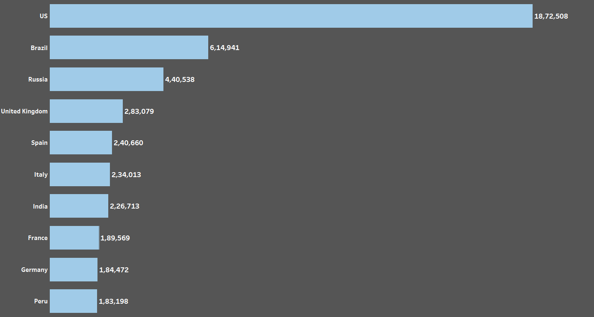
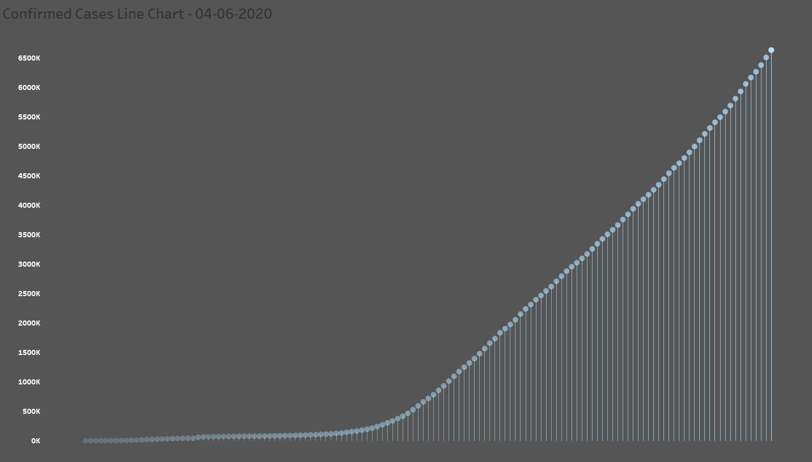
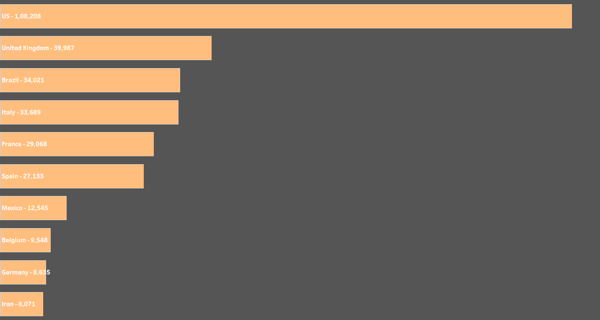
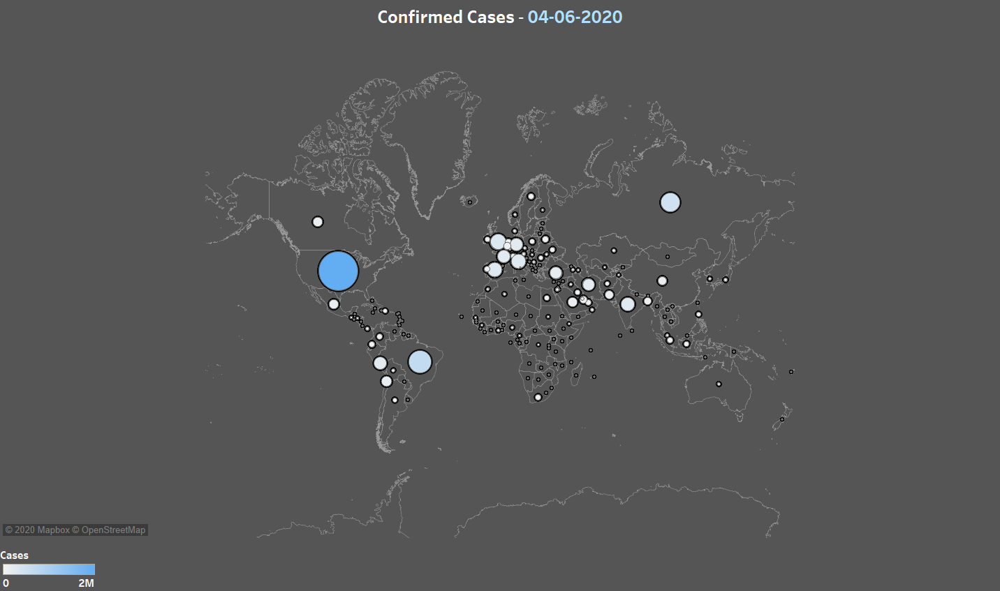
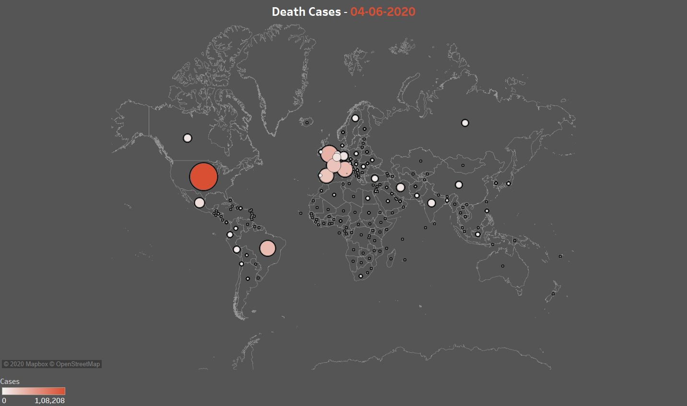

# COVID-19 Data Visualisation Using Tableau

> [Description](#description)

> [Data Source](#data-source)

> [Built With](#built-with)

> [Visualisations](#visualisations)

> [Dashboard](#dashboard)

> [Credit](#credit)

---

# Description

Coronavirus disease (COVID-19) is an infectious disease caused by a newly discovered coronavirus.
So, it becomes the most important data right now. In this project I've created a dashboard which 
works as a global coronavirus tracker to help you stay updated on the confirmed cases and the death cases,
the spread of coronavirus across the world, and the top 10 countries affected by this pandemic.

---

# Data Source

COVID-19 case data can be directly downloaded or accessed through   <a href="https://data.world/covid-19-data-resource-hub/covid-19-case-counts/workspace/file?filename=COVID-19+Cases.csv" target="_blank">**data.world**</a>.

---

# Built With

- <a href="https://public.tableau.com/en-us/s/" target="_blank">**Tableau**</a>

---

# Visualisations

Some of the visualisations are shown below

---

---

---

---

---

# Dashboard

---

# Credit

- Inspired by ★★★★★ Anthony B. Smoak
